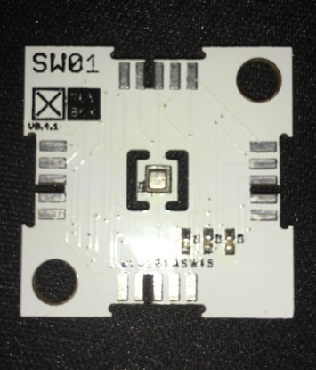

# ☒CHIP SW01 

Digital (I2C) Humidity, Pressure and Temperature Sensor.
This module can be purchased on [Xinabox CC](https://xinabox.cc/modules/sensors/SW01/)

## About the SW01
The SW01 makes use of the BME280 produced by Bosch.This precision sensor from Bosch is the best low-cost sensing solution for measuring barometric pressure,temperature and relative humidity. Making use of changes in pressure allows for the measurement of alititude because pressure changes with altitude, therefore allowing it to be used as a altimeter.

The SW01 module is housed in an extremely compact 2U×2U chip. SW01 was designed to have the sensor isolated in the middle of the ☒CHIP to safeguard the sensor against any unwanted heat radiated from the other devices. 

More information on the BME280 can be found in the [datasheet](https://ae-bst.resource.bosch.com/media/_tech/media/datasheets/BST-BME280_DS001-11.pdf)

NASA/DOD TRL level 6 and the sensor is RoSH compliant.

## Portability
*TODO

